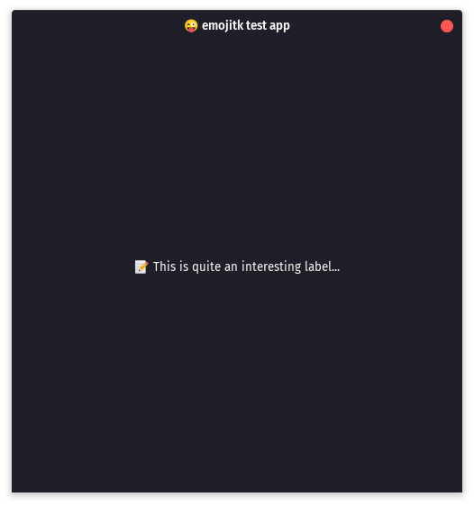

<!-- DO NOT REMOVE - contributor_list:data:start:["cjdenio"]:end -->

# emojitk

hey look a clever name (emoji + gtk, get it?)

## building

idk `./build.sh` might work 🤷

make sure you install `libgtkmm-3.0` via your system's package manager! try `sudo apt install libgtkmm-3.0-dev` on debian-based systems ✨

the built library will be available in `packages/emojitk/`

## example

```
📦 emojitk 🏠

🏁🍇
    💭 create the app
    🆕📱🔤me.calebdenio.gtk.test🔤❗ ➡️ app

    💭 create a window with the given title and dimensions
    🆕🖼️🔤😜 emojitk test app🔤 500 500❗ ➡️ window

    💭 create a label
    🆕📝 🔤📝 This is quite an interesting label...🔤❗ ➡️ label

    💭 add the label to the window
    📬window label❗

    💭 start the app!
    🏁app window❗
🍉
```

## screenshot

> Taken on [Pop!\_OS 20.10](https://pop.system76.com) with the [Dracula](https://draculatheme.com/gtk) GTK theme



<!-- prettier-ignore-start -->
<!-- DO NOT REMOVE - contributor_list:start -->
## 👥 Contributors


- **[@cjdenio](https://github.com/cjdenio)**

<!-- DO NOT REMOVE - contributor_list:end -->
<!-- prettier-ignore-end -->
